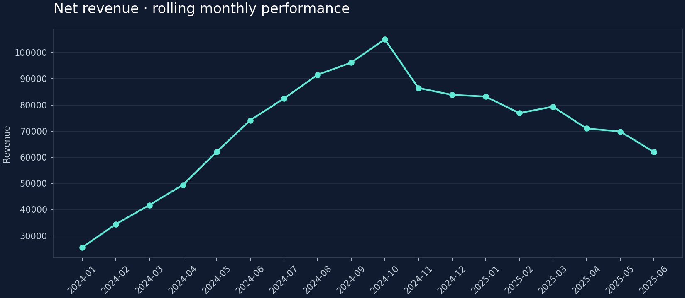

# Retail Growth & Profitability

**Data analyst portfolio · Python · SQL · Excel · Power BI sources · Tableau sources**

Identify profitable growth and retention opportunities without confusing sales volume with contribution profit.



## Live dashboard

[Open interactive dashboard](https://harshvtomar.github.io/retail-growth-profitability/)

Hosted on GitHub Pages from `main` → `/docs`. The dashboard provides segment filters, KPI cards, trends, detailed tables, and CSV export using synthetic data. To publish dashboard changes, copy `dashboard/index.html` to `docs/index.html` and commit both files; GitHub Pages redeploys automatically. Power BI and Tableau verification status is documented separately in `bi/validation.json`.

## Run locally

```bash
python -m venv .venv
source .venv/bin/activate  # Windows: .venv\Scripts\activate
pip install -r requirements.txt
python scripts/analyze.py
python scripts/run_sql.py
python -m unittest discover -s tests -v
```

Python 3.11+ recommended. Open `dashboard/index.html` in your browser: it works offline, with segment filtering, KPI cards, an SVG trend, comparative bars, and CSV export. Generated results are committed for immediate review. The notebook runs the same canonical pipeline to avoid divergent business logic. No API keys required.

## Analytical depth

Customer/order join validation; first-purchase cohort retention; RFM segmentation; category economics; rolling forecast backtest against a naive baseline.

## Data and definitions

**All input data is synthetic, deterministic, and generated by this project.** This is an independently created demonstration, not employer work or real customer/financial data. Financial values are simulated USD. See `docs/data_dictionary.md` for fields and `docs/methodology.md` for assumptions and limitations.

orders.csv: one order per row; customers.csv: one customer per row. Generated January 2024–June 2025. Cohorts use first purchase, not registration. Contribution deducts COGS and fulfillment including returns; acquisition cost and fixed overhead are excluded.

## Excel, Power BI and Tableau

| Tool | Added assets | Verification status |
|---|---|---|
| Excel | Formula dashboard, segment control, native charts, tables, project lab | Calculations/input changes and exported objects checked; Excel native open/save pending |
| Power BI | PBIP/PBIR report, star schema, M queries, DAX measures | Source data, bindings and relationships checked; native open/refresh/DAX/render pending |
| Tableau | TWB, packaged TWBX, TDS and aggregate calculated fields | XML and packaged data checked; native open/calculations/filter/render pending |

Regenerate the BI source assets after rerunning the analysis with `python scripts/build_bi_assets.py`. This overwrites generated Power BI/Tableau sources; keep native app edits in a separately named saved file. Excel formulas refresh existing input edits; new source months require extending workbook ranges.

Start with [`excel/README.md`](excel/README.md), [`powerbi/README.md`](powerbi/README.md), and [`tableau/README.md`](tableau/README.md). Complete [`docs/hands_on_practice.md`](docs/hands_on_practice.md) before claiming proficiency. The original generated BI source packages still need native import verification. Separate native browser reports have now been tested: see [browser verification](bi/browser-verification/README.md) for the published Tableau dashboard, Power BI report, evidence and exact scope. No tested PBIX or native TWBX export is included.

## Repository map

| Path | Purpose |
|---|---|
| `scripts/analyze.py` | Seeded data generation, analytical pipeline, charts and dashboard build |
| `sql/analysis.sql` | Executable SQLite CTEs, aggregations, joins and window functions |
| `notebooks/analysis.ipynb` | Reproducible walkthrough and output inspection |
| `dashboard/index.html` | Fully self-contained interactive dashboard |
| `data/*.csv` | Portable source tables |
| `outputs/*.csv` | Analysis and SQL result tables |
| `outputs/executive_brief.md` | Results, proposed actions and limitations |
| `tests/test_analysis.py` | Data contracts, numerical reconciliation and analytical safeguards |

## Review the evidence

Read [the decision brief](outputs/executive_brief.md), [methodology](docs/methodology.md), and [metric summary](outputs/summary.json). Recommendations are hypotheses for validation; synthetic relationships and backtests do not establish real-world impact. Dashboard logic checks: `node tests/dashboard.test.cjs` (Node 18+; no npm install). These verify all segment filters, KPI updates, reset behavior, SVG trend construction, and exported CSV row counts; visual browser rendering has not been tested in this environment.

CI regenerates the complete project, executes SQL, and runs checks on Python 3.11 and 3.12.

## Reproducibility

Tested environment: Python 3.12.14, NumPy 2.3.5, pandas 2.2.3, scikit-learn 1.8.0. `requirements-lock.txt` records the actual installed analysis dependencies. Random seeds are explicit. Dependencies are version-bounded; small floating-point differences across platforms are expected. All tests use numerical tolerances where needed.

Created as a portfolio demonstration for **Harsh Vardhan Tomar**. MIT-licensed code; synthetic datasets are generated by the included code under the same license.
